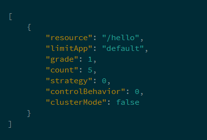

# sentinel 整合 nacos
## pom 文件属性
spring.cloud.sentinel.transport.dashboard：sentinel dashboard的访问地址，根据上面准备工作中启动的实例配置
spring.cloud.sentinel.datasource.ds.nacos.groupId：nacos中存储规则的groupId
spring.cloud.sentinel.datasource.ds.nacos.dataId：nacos中存储规则的dataId
spring.cloud.sentinel.datasource.ds.nacos.rule-type：该参数是spring cloud alibaba升级到0.2.2之后增加的配置，用来定义存储的规则类型。
所有的规则类型可查看枚举类：org.springframework.cloud.alibaba.sentinel.datasource.RuleType，每种规则的定义格式可以通过各枚举值中定义的规则对象来查看，比如限流规则可查看：com.alibaba.csp.sentinel.slots.block.flow.FlowRule
这里对于dataId使用了${spring.application.name}变量，这样可以根据应用名来区分不同的规则配置。

## Nacos中创建限流规则的配置
resource：资源名，即限流规则的作用对象
limitApp：流控针对的调用来源，若为 default 则不区分调用来源
grade：限流阈值类型（QPS 或并发线程数）；0代表根据并发数量来限流，1代表根据QPS来进行流量控制
count：限流阈值
strategy：调用关系限流策略
controlBehavior：流量控制效果（直接拒绝、Warm Up、匀速排队）
clusterMode：是否为集群模式
###示例

